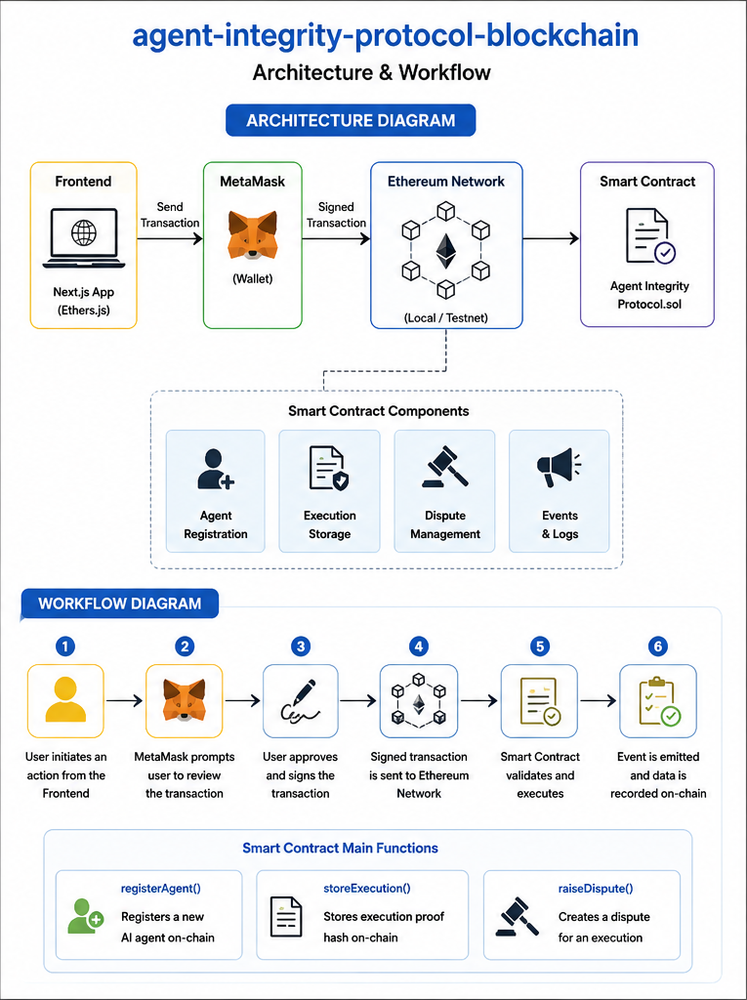

# ⛓️ Agent Integrity Protocol Smart Contract

Solidity smart contract powering the Agent Integrity Protocol. The contract enables AI agent registration, execution proof storage, and dispute management on the Ethereum blockchain.

---

## 🚀 Features

- 🤖 Register AI Agents
- 📜 Store Execution Proofs
- ⚖️ Raise Disputes
- 📢 Smart Contract Events
- 🔒 On-chain Verification

---

## 🛠️ Tech Stack

- Solidity
- Hardhat
- TypeScript
- Ethers.js

---

## 📂 Project Structure
contracts/
scripts/
artifacts/
cache/
typechain-types/

---

## 📜 Smart Contract Functions

### Register Agent

```solidity
registerAgent(
    string name,
    string agentType,
    uint256 trustScore,
    uint256 stake
)
```
Registers an AI agent on-chain.
```Store Execution
storeExecution(
    string executionId,
    string proofHash
)
```
Stores execution proof.
```Raise Dispute
raiseDispute(
    string executionId,
    string reason
)
```
Creates a dispute record.

## ⚙️ Installation

Clone

git clone https://github.com/Sanaya77/agent-integrity-protocol-blockchain.git

Install dependencies

npm install

Compile contracts

npx hardhat compile

Start local blockchain

npx hardhat node

Deploy

npx hardhat run scripts/deploy.ts --network localhost

## 📦 Contract Components
Agent Registration
Execution Storage
Dispute Management
Events
On-chain Records

## 🌱 Future Improvements
ERC20 Staking
IPFS Proof Storage
DAO Governance
Reputation System
Multi-signature Verification
Testnet Deployment

## Architecture and workflow


👩‍💻 Author

Sanaya Y. Kulkarni

GitHub:
https://github.com/Sanaya77
